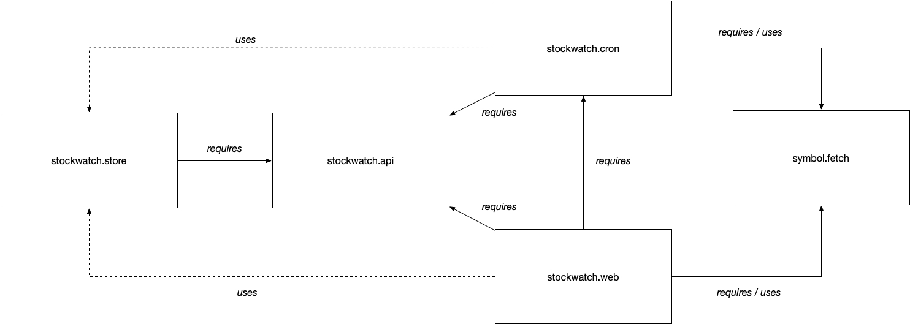

Demo project for "The Java Module System in Action: Building a distributed web app" for CodeOne.
It shows an application based on the module system, using services, external frameworks (Vert.x and Jackson), black box module testing and more.

The following diagram describes the structure of the application.

The Gradle build uses the [Gradle modules plugin](https://github.com/java9-modularity/gradle-modules-plugin) that takes care of all the Gradle 
settings that are required to work with the module system.

The entrypoint of the application is the `stockwatch.web` module which contains a main class.
The `applicaiton` plugin is enabled, which let you run commands such as:

* ./gradlew run
* ./gradlew distTar

The modules plugin configures the application plugin to setup the module path and such.